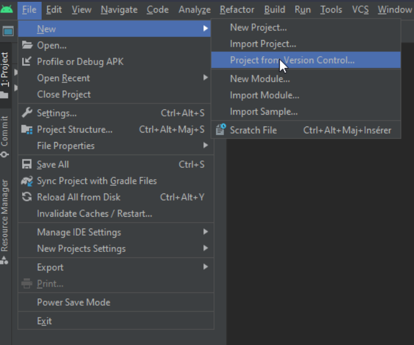
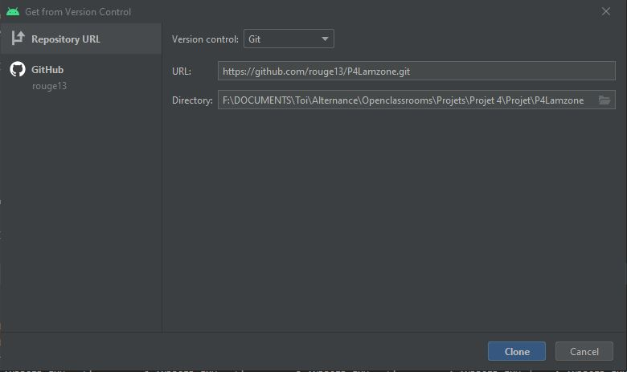

# **Projet N°3 : "Entrevoisins" OPENCLASSROOMS**
_________________________________________________________________________________________________________________

Ce dépot contient une mini-application pour le Projet 4 du parcours Grande École du Numérique pour le cursus Développeur d'Application Android

## Introduction de ce projet

"Maréu" est une application qui permet la gestion des réunions au sein d'une même entreprise avec les dates (début et fin de réunion), la salle et les participants de cette réunion.
_________________________________________________________________________________________________________________

## Android Studio et lien vers le projet **"Maréu"**
_________________________________________________________________________________________________________________
### 1. Installation et paramétrage d’Android Studio :  **[Lien d'installation](https://developer.android.com/studio)**
Avant de procéder à l’installation, identifiez le système d'exploitation de votre ordinateur. Si vous avez besoin d’aide pour l'installation et le paramétrage du logiciel, vous pouvez utiliser ce **[tutoriel](https://www.tutorialspoint.com/android/android_studio.htm)** en ligne

### 2. Téléchargez le code du projet avec git clone : **via ce [lien](https://github.com/rouge13/P4Lamzone/tree/develop)**

_________________________________________________________________________________________________________________

## Configuration pour accéder au projet
_________________________________________________________________________________________________________________

### 3. Ouvrez Android Studio. Cliquez sur "File" -> "New" -> "Check out project from Version Control" puis sur "Git"


### 4. Copier et coller l'Url du dépôt Git dans le champ "URL"


## Ou utilisez Git Bash et rentrez la ligne de commande suivante


###  NB : Si vous souhaitez enregistrer le projet sur un dossier de votre choix (autre que celui proposé par Android), modifiez le dossier d'installation du dépôt dans le champ "Directory"
Le projet est actuellement sur la branche : [develop](Branche_actuelle.jpg)


_________________________________________________________________________________________________________________

## Synchronisation Gradle et application
_________________________________________________________________________________________________________________

### 6. Si le message Sync apparait en haut à droite, synchronisez le projet avec Gradle en cliquant sur l'icône "éléphant"

### 7. Compilez le projet à l'aide de l'icône "marteau"

### 8. Si besoin, sélectionnez un appareil Android et lancez le projet en cliquant sur l'icône "flèche verte" en vérifiant bien que "app" soit bien sélectionnée à droite du marteau et fonctionne sous 



_________________________________________________________________________________________________________________

## Modifications réalisées : 
- *Ajout du layout pour afficher un seul voisin et la possibilité de les ajouter dans les favoris*
- *Ajout d'une liste avec les voisins ajoutés dans les favoris*
- *Création des différentes classes pour réaliser cette fonctionnalités*
- *Réalisation de [tests unitaires](https://refined-github-html-preview.kidonng.workers.dev/rouge13/P3Entrevoisins/raw/Feature/ShowDetailsOfPeopleAndAddInFavorite/Test%20Results%20-%20NeighbourServiceTest.html)*
- *Réalisation des tests instrumentés :*
(*[ProjectActivitiesTest](https://github.com/rouge13/P3Entrevoisins/blob/Feature/ShowDetailsOfPeopleAndAddInFavorite/Test%20Results%20-%20DeleteANeighbour.html)*)
- *Ajout du Fichier README.md pour l'installation du projet sur un autre poste*














